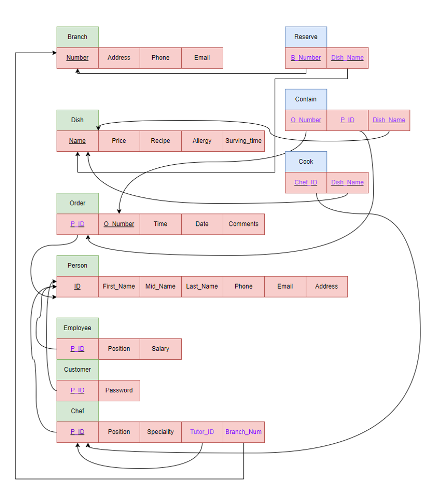
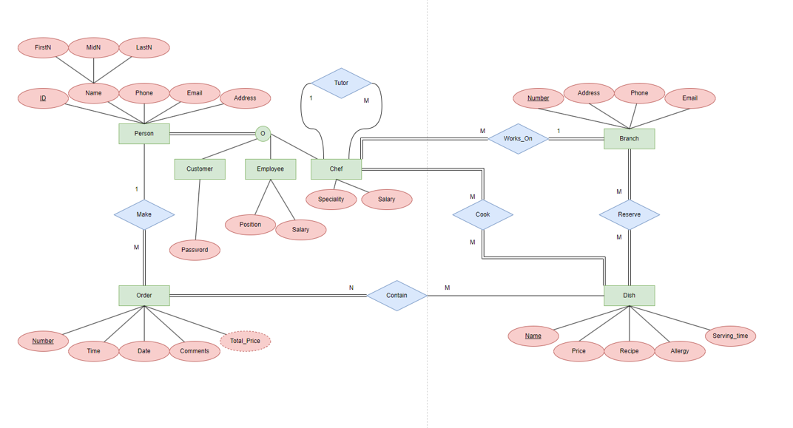

# Restaurant RDBMS Architecture

## Project Overview
This portfolio project presents the design and implementation of a fully normalized relational database for a restaurant business transitioning from a single branch to a multi-branch operation. Alongside expansion, the business is launching a new customer ordering application and requires a scalable, reliable data architecture.  
The solution addresses prior system limitations by introducing structured support for branch-level operations, menu management (including dishes, recipes, and serving times), diverse user roles (Customers, Employees, and Chefs), chef specialization and tutoring hierarchy, and a robust transactional order model that links branches, customers, and chefs.

## Database Design
The database was developed through a structured Entity-Relationship (ER) modeling process, beginning with identifying core business entities, relationships, and cardinalities, and then converting the conceptual model into a normalized relational schema suitable for implementation in an RDBMS environment.

## Technical Highlights
- Implementation of **composite keys** to enforce uniqueness across multi-attribute business rules.
- Use of **cascading foreign keys** to preserve referential integrity across dependent tables.
- Execution of **multi-table INNER and OUTER JOINs** for comprehensive data retrieval across related entities.
- Use of **nested subqueries** to support advanced analytical and transactional query logic.

## Tech Stack
- **SQL** (Oracle/PostgreSQL compatible)
- **Relational Database Management Systems (RDBMS)**
- **Entity-Relationship Modeling**

## Files Included
- **`schema_and_queries.sql`**: Contains the full DDL definition for **10 tables** and DML statements implementing complex relational queries.
